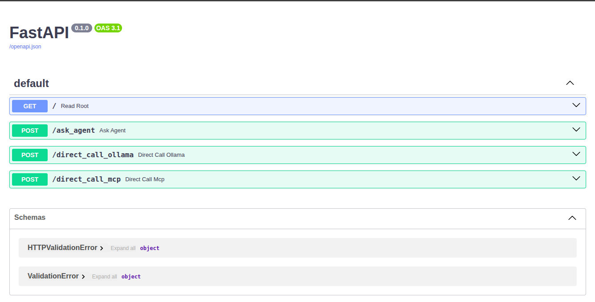
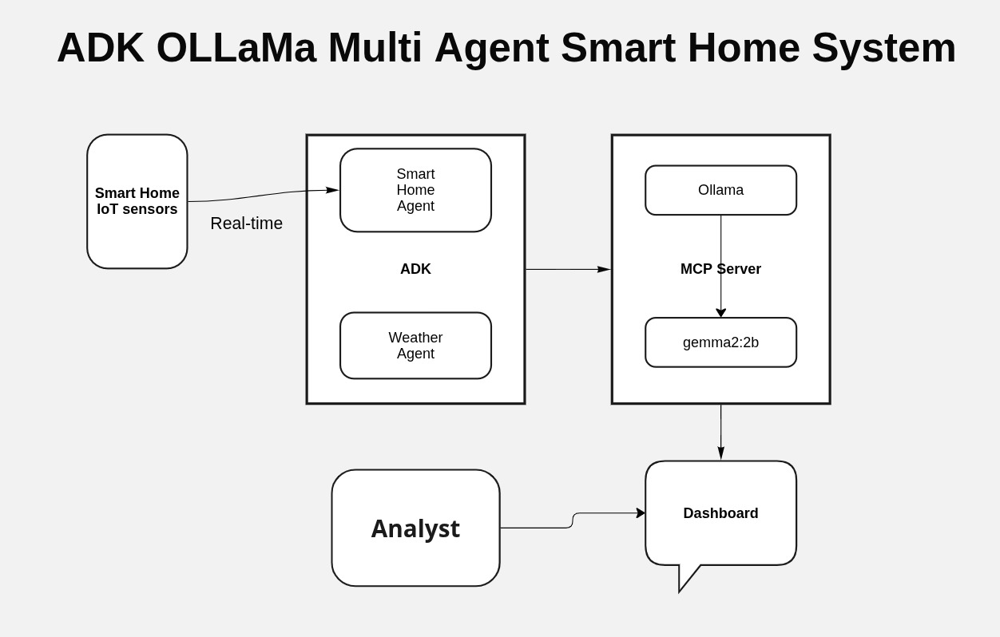
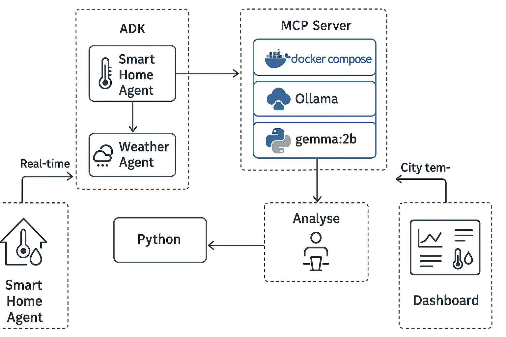

# ADK Smart House Multi-Agent System

A comprehensive multi-agent microservice application leveraging ADK (Agent Development Kit) for smart house IoT monitoring and city-wide weather analytics. This system combines Arduino-based temperature and humidity sensors with intelligent weather forecasting agents to create a complete environmental monitoring solution.



## 🏠 System Overview

This application consists of multiple specialized agents working together to provide:
- **Smart House Monitoring**: Real-time temperature and humidity data from Arduino IoT sensors
- **City Weather Intelligence**: Comprehensive weather analysis and forecasting for urban areas
- **Multi-Agent Coordination**: Seamless communication between IoT and weather agents
- **AI-Powered Analytics**: Ollama-based LLM integration for intelligent data processing

## 🏗️ Architecture

### Core Components

- **IoT Agent** (`iot-agent`): Processes Arduino sensor data (temperature, humidity)
- **Weather Agent** (`weather-agent`): Handles city-wide weather data and forecasting
- **API Gateway**: Unified entry point for all agent communications
- **Web Dashboard**: React-based frontend for visualization and control
- **Ollama Service**: Local LLM for intelligent data processing
- **Redis**: Caching layer for improved performance
- **PostgreSQL**: Persistent storage for agent interactions and historical data

### Multi-Agent Architecture

```
┌─────────────────┐    ┌─────────────────┐
│   IoT Agent     │    │ Weather Agent   │
│ (Arduino Data)  │    │ (City Weather)  │
└─────────────────┘    └─────────────────┘
         │                       │
         └───────────┬───────────┘
                     │
         ┌─────────────────┐
         │  API Gateway    │
         │ (Coordination)  │
         └─────────────────┘
                     │
         ┌─────────────────┐
         │   Dashboard     │
         │ (Visualization) │
         └─────────────────┘
```
* Correct architecture diaggram



* Not correct generated by ChatGPT 




## 🚀 Quick Start

### Prerequisites

- Docker and Docker Compose
- NVIDIA GPU (optional, for enhanced LLM performance)
- Weather API key (for weather agent)

### Installation

1. **Clone the repository**
   ```bash
   git clone <repository-url>
   cd adk-smart-house
   ```

2. **Set up environment variables**
   ```bash
   cp .env.example .env
   # Edit .env and add your WEATHER_API_KEY
   ```

3. **Build and start services**
   ```bash
   docker-compose up -d
   ```

4. **Initialize Ollama models**
   ```bash
   # Models will be automatically pulled via ollama-init service
   # Wait for initialization to complete
   ```

### Service Endpoints

- **Dashboard**: http://localhost:3000
- **API Gateway**: http://localhost:8000
- **IoT Agent**: http://localhost:8001
- **Weather Agent**: http://localhost:8002
- **Ollama**: http://localhost:11434

## 📊 Agent Capabilities

### IoT Agent (Smart House)
- **Temperature Monitoring**: Real-time Arduino sensor data processing
- **Humidity Tracking**: Environmental humidity analysis
- **Sensor Health**: Device status and connectivity monitoring
- **Data Validation**: Intelligent filtering and anomaly detection
- **Historical Analysis**: Trend identification and pattern recognition

### Weather Agent (City-Wide)
- **Weather Forecasting**: Multi-day weather predictions
- **Climate Analysis**: Long-term weather pattern analysis
- **Alert System**: Severe weather notifications
- **Data Integration**: Multiple weather data source aggregation
- **Urban Analytics**: City-specific weather insights

### API Gateway
- **Request Routing**: Intelligent routing between agents
- **Load Balancing**: Distributed request handling
- **Authentication**: Secure agent communication
- **Rate Limiting**: Resource protection and optimization
- **Monitoring**: Health checks and performance metrics

## 🔧 Configuration

### Environment Variables

```env
# Weather API Configuration
WEATHER_API_KEY=your_weather_api_key_here

# Database Configuration
POSTGRES_DB=adk_agents
POSTGRES_USER=adk_user
POSTGRES_PASSWORD=adk_password

# Service URLs
OLLAMA_URL=http://ollama:11434
IOT_AGENT_URL=http://iot-agent:8000
WEATHER_AGENT_URL=http://weather-agent:8000
```

### Arduino Sensor Setup

[(Get from my blog) !https://dhirajpatra.blogspot.com/2023/08/iot-real-time-data-analysis.html?q=iot+real+time]

1. **Hardware Requirements**:
   - Arduino Uno/Nano/ESP32
   - DHT22 or DHT11 temperature/humidity sensor
   - WiFi module (for ESP32) or Ethernet shield

2. **Sensor Wiring**:
   ```
   DHT22 VCC  -> Arduino 5V
   DHT22 GND  -> Arduino GND
   DHT22 DATA -> Arduino Pin 2
   ```

3. **Arduino Code**:
   ```cpp
   // Upload the provided Arduino sketch
   // Configure WiFi credentials
   // Set IoT Agent endpoint URL
   ```

## 🛠️ Development

### Project Structure

```
adk-smart-house/
├── docker-compose.yml
├── .env.example
├── init-db.sql
├── scripts/
│   └── init-ollama.sh
├── iot-agent/
│   ├── Dockerfile
│   ├── requirements.txt
│   └── app.py
├── weather-agent/
│   ├── Dockerfile
│   ├── requirements.txt
│   └── app.py
├── api-gateway/
│   ├── Dockerfile
│   ├── requirements.txt
│   └── app.py
└── dashboard/
    ├── Dockerfile
    ├── package.json
    └── src/
```

### Adding New Agents

1. **Create Agent Directory**
   ```bash
   mkdir new-agent
   cd new-agent
   ```

2. **Implement Agent Logic**
   ```python
   # Follow the existing agent patterns
   # Implement health checks
   # Add error handling
   ```

3. **Update Docker Compose**
   ```yaml
   new-agent:
     build:
       context: ./new-agent
     ports:
       - "8003:8000"
     depends_on:
       - ollama
   ```

### Local Development

```bash
# Start individual services
docker-compose up ollama redis postgres

# Run agents locally
cd iot-agent
python app.py

cd weather-agent
python app.py
```

## 📈 Monitoring & Health Checks

### Health Endpoints

- **IoT Agent**: `GET /health`
- **Weather Agent**: `GET /health`
- **API Gateway**: `GET /health`
- **Ollama**: `GET /api/tags`

### Monitoring Dashboard

Access real-time system metrics at: http://localhost:3000/monitoring

### Log Analysis

```bash
# View all service logs
docker-compose logs -f

# View specific service logs
docker-compose logs -f iot-agent
docker-compose logs -f weather-agent
```

## 🔒 Security Considerations

- **API Authentication**: Implement JWT tokens for production
- **Network Security**: Use Docker networks for service isolation
- **Data Encryption**: Enable TLS for external communications
- **Environment Variables**: Never commit sensitive data to version control
- **Resource Limits**: Configure appropriate memory and CPU limits

## 📚 API Documentation

### IoT Agent Endpoints

```
POST /sensor-data    # Submit Arduino sensor readings
GET  /current-data   # Get latest sensor data
GET  /history        # Get historical sensor data
GET  /analytics      # Get AI-powered insights
```

### Weather Agent Endpoints

```
GET  /current-weather    # Get current city weather
GET  /forecast          # Get weather forecast
GET  /alerts            # Get weather alerts
POST /analyze-pattern   # Analyze weather patterns
```

### API Gateway Endpoints

```
GET  /status           # System status
POST /agent-query      # Multi-agent query
GET  /agent-health     # All agent health status
```

## 🚨 Troubleshooting

### Common Issues

1. **Ollama Model Loading**
   ```bash
   # Check if models are loaded
   curl http://localhost:11434/api/tags
   
   # Manually pull models
   docker exec ollama ollama pull gemma:2b
   ```

2. **Agent Communication**
   ```bash
   # Test agent connectivity
   curl http://localhost:8001/health
   curl http://localhost:8002/health
   ```

3. **Database Connection**
   ```bash
   # Check PostgreSQL status
   docker-compose logs postgres
   
   # Connect to database
   docker exec -it postgres psql -U adk_user -d adk_agents
   ```

## 🤝 Contributing

1. Fork the repository
2. Create a feature branch
3. Implement your changes
4. Add tests and documentation
5. Submit a pull request

## 📄 License

This project is licensed under the MIT License - see the LICENSE file for details.

## 🙏 Acknowledgments

- ADK (Agent Development Kit) team
- Ollama project for local LLM capabilities
- Arduino community for IoT sensor integration
- Weather API providers for meteorological data

---

**Note**: This is a development environment setup. For production deployment, additional security measures, monitoring, and scaling considerations should be implemented.