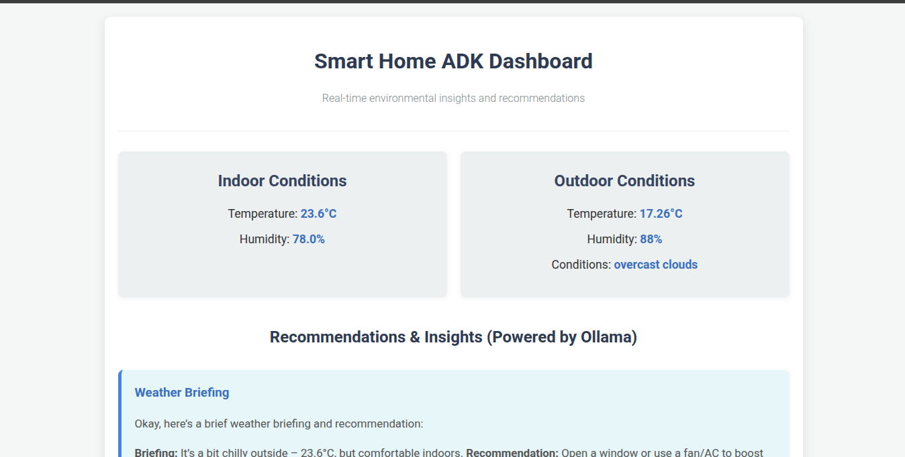
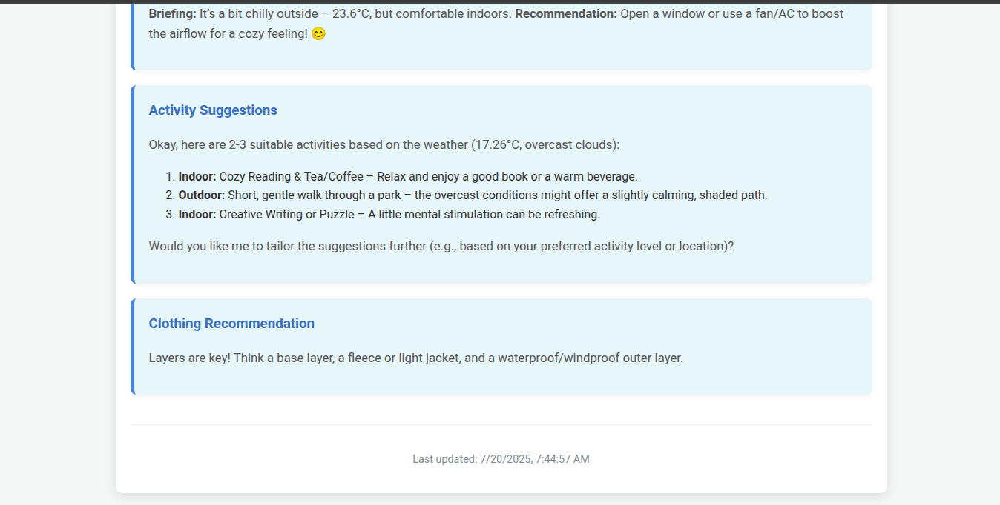

# ADK Smart House Multi-Agent System

A comprehensive multi-agent microservice application leveraging ADK (Agent Development Kit) for smart house IoT monitoring and city-wide weather analytics. This system combines Arduino-based temperature and humidity sensors with intelligent weather forecasting agents to create a complete environmental monitoring solution.

<iframe width="560" height="315" src="https://www.youtube.com/embed/a23dj6KWT60?si=9Q6BnLuA0oY14IBq" frameborder="0" allowfullscreen></iframe>






Google Home App
   ↓
POST /google_home/fulfillment
   ↓
handle_query_intent() — server.py
   ↓
httpx GET → ADK_APP_URL/get_indoor_status/
   ↓
@app.get("/get_indoor_status/") — app.py
   ↓
returns smart_home_agent._state
   ↓
smart_home_agent.py → populated via MQTT topic smarthome/arduino/humidity


This multi-agent application, combining a local Smart Home agent (Arduino-based sensors) with a cloud-connected Weather API agent (OpenWeatherMap), built on ADK and Ollama, has a strong foundation. Here are several real-world problems it can solve, ranging from immediate applications to more advanced scenarios with minor changes:

## Real-Life Problems Solvable by Your Current/Slightly Modified Application:

### 1. **Smart Home Automation & Monitoring (Core Use Case)**
* **Problem:** Lack of unified monitoring and basic automation in homes. Residents often manually adjust heating/cooling or aren't aware of environmental conditions.
* **Solution:**
    * **Temperature & Humidity Regulation:** Your system can monitor indoor temperature and humidity. With a minor addition (e.g., a relay connected to an HVAC system or a fan), the Smart Home Agent could automatically turn on/off heating, cooling, or a humidifier/dehumidifier to maintain desired comfort levels.
    * **Environmental Alerts:** Send notifications (via a connected messaging service like Telegram, SMS, or email) if temperature/humidity goes above/below set thresholds (e.g., "Humidity too high, risk of mold," "Temperature dropped significantly").
    * **Pet/Plant Care:** Ensure optimal conditions for pets or indoor plants, triggering fans or misters if conditions deviate.

### 2. **Energy Efficiency & Cost Saving**
* **Problem:** Wasted energy due to manual control of appliances or unawareness of indoor/outdoor conditions.
* **Solution:**
    * **Intelligent HVAC Control:** Combine indoor temperature/humidity with outdoor weather data. For example, if the outdoor temperature is pleasant, the system could suggest opening windows instead of running the AC. If humidity is high outside, it could prioritize dehumidification inside.
    * **Pre-cooling/heating:** Based on predicted outdoor temperatures (from the weather API) and historical indoor patterns, the system could pre-cool or pre-heat the house more efficiently before peak demand or occupant arrival.
    * **Demand Response (Advanced):** If integrated with utility pricing data, optimize energy usage during off-peak hours.

### 3. **Enhanced Security & Safety**
* **Problem:** Limited awareness of potential hazards related to environmental conditions.
* **Solution (with minor sensor additions):**
    * **Early Freeze Warning:** If you add a water leak sensor, combine it with a low indoor temperature reading to alert about potential pipe freezing.
    * **Fire/Smoke Alarm Integration:** Integrate with smart smoke/CO detectors. While not directly environmental, it leverages the smart home backbone for critical alerts.
    * **Flood Prevention:** Combine humidity sensors with a water sensor. If humidity spikes after rain, and a water sensor detects a leak, send an immediate alert.

### 4. **Context-Aware Information & Recommendations**
* **Problem:** Information overload or lack of relevant context for daily decisions.
* **Solution:**
    * **Personalized Weather Briefings:** Instead of just "It's 25°C outside," the system could say, "It's 25°C outside, but 28°C inside, and humidity is rising. You might want to open a window, or I can turn on the fan."
    * **Activity Suggestions:** Based on outdoor weather, suggest activities. "It's sunny and mild today, perfect for a walk!" or "Heavy rain expected, good day to stay in and read."
    * **Clothing Recommendations:** "Given the current outdoor temperature and forecast, you'll need a light jacket for your commute."

### 5. **Agricultural/Gardening Monitoring (Microclimate)**
* **Problem:** Farmers or gardeners need precise microclimate data to optimize crop growth, prevent disease, and manage irrigation.
* **Solution:**
    * **Greenhouse Monitoring:** Deploy your Arduino sensors in a greenhouse to monitor specific temperature and humidity. The system can then inform automated ventilation or irrigation systems.
    * **Disease Prevention:** Certain plant diseases thrive in specific temperature and humidity ranges. Your system could alert growers if conditions become favorable for such diseases.
    * **Irrigation Optimization:** Combine local soil moisture sensors (minor addition) with your temp/humidity and external rainfall data to create highly efficient irrigation schedules.

### 6. **Data Collection & Analytics for Research/Optimization**
* **Problem:** Difficulty in collecting continuous, localized environmental data for research, building performance analysis, or simply understanding long-term trends.
* **Solution:** Your system inherently collects time-series data. This data can be logged to a database and used for:
    * **Building Performance Studies:** Analyze how indoor conditions fluctuate with outdoor weather and occupant behavior.
    * **Long-term Environmental Monitoring:** Contribute to local climate studies or personal health research by understanding living conditions.
    * **Predictive Maintenance:** Monitor sensor drift or unusual patterns to anticipate sensor failure.

### 7. **Elderly Care / Assisted Living (with modifications)**
* **Problem:** Ensuring comfortable and safe living conditions for individuals who may have difficulty regulating their environment or noticing subtle changes.
* **Solution (Requires careful ethical consideration and explicit consent):**
    * **Automated Climate Control:** Adjust temperature/humidity based on pre-set preferences or adaptive learning.
    * **Abnormal Condition Alerts:** If a room becomes unusually cold/hot for an extended period, send an alert to a caregiver.
    * **Air Quality Monitoring:** Integrate air quality sensors (VOC, CO2) to ensure a healthy indoor environment.

### Leveraging ADK and Multi-Agent Architecture for these problems:

The ADK framework and multi-agent approach are key strengths because:

* **Modularity:** You can easily add more sensors (agents) without re-architecting everything.
* **Interoperability:** Agents can share information (e.g., Smart Home agent asking Weather agent for outdoor temp).
* **Scalability:** As you mentioned, moving to GCP is a natural progression as your application grows, allowing for more data, more agents, and more complex logic.
* **Intelligent Reasoning (Ollama/LLMs):** The LLM layer allows for natural language interaction, complex decision-making based on combined data, and more nuanced responses than simple rule-based systems. For example, instead of just "Temp too high," the LLM could interpret "It's a hot day, and the indoor temperature is also rising, suggesting the AC needs to be stronger, or maybe you left a window open?"

This setup is a fantastic starting point for building sophisticated, context-aware smart home and environmental monitoring solutions.

## 🏠 System Overview

This application consists of multiple specialized agents working together to provide:
- **Smart House Monitoring**: Real-time temperature and humidity data from Arduino IoT sensors
- **City Weather Intelligence**: Comprehensive weather analysis and forecasting for urban areas
- **Multi-Agent Coordination**: Seamless communication between IoT and weather agents
- **AI-Powered Analytics**: Ollama-based LLM integration for intelligent data processing

## 🏗️ Architecture

### Core Components

- **IoT Agent** (`iot-agent`): Processes Arduino sensor data (temperature, humidity)
- **Weather Agent** (`weather-agent`): Handles city-wide weather data and forecasting
- **API Gateway**: Unified entry point for all agent communications
- **Web Dashboard**: React-based frontend for visualization and control
- **Ollama Service**: Local LLM for intelligent data processing
- **Redis**: Caching layer for improved performance
- **PostgreSQL**: Persistent storage for agent interactions and historical data

### Multi-Agent Architecture

```

┌─────────────────┐    ┌─────────────────┐
│   IoT Agent     │    │ Weather Agent   │
│ (Arduino Data)  │    │ (City Weather)  │
└─────────────────┘    └─────────────────┘
│                       │
└───────────┬───────────┘
│
┌─────────────────┐
│  API Gateway    │
│ (Coordination)  │
└─────────────────┘
│
┌─────────────────┐
│   Dashboard     │
│ (Visualization) │
└─────────────────┘

````
* Correct architecture diaggram


* Not correct generated by ChatGPT 


## 🚀 Quick Start

### Prerequisites

- Docker and Docker Compose
- NVIDIA GPU (optional, for enhanced LLM performance)
- Weather API key (for weather agent)

### Installation

1. **Clone the repository**
   ```bash
   git clone <repository-url>
   cd adk-smart-house
````

2.  **Set up environment variables**

    ```bash
    cp .env.example .env
    # Edit .env and add your WEATHER_API_KEY
    ```

3.  **Build and start services**

    ```bash
    docker-compose up -d
    ```

4.  **Initialize Ollama models**

    ```bash
    # Models will be automatically pulled via ollama-init service
    # Wait for initialization to complete

    # Option 1: If Ollama is installed on your host
    ollama pull gemma3:1b

    # Option 2: Run Ollama service only, then exec into it to pull
    docker compose up -d ollama
    docker exec -it ollama ollama pull gemma3:1b
    # Then stop ollama and run the full stack
    docker compose down ollama
    ```

### Service Endpoints

  - **Dashboard**: http://localhost:3000
  - **API Gateway**: http://localhost:8000
  - **IoT Agent**: http://localhost:8001
  - **Weather Agent**: http://localhost:8002
  - **Ollama**: http://localhost:11434

## 📊 Agent Capabilities

### IoT Agent (Smart House)

  - **Temperature Monitoring**: Real-time Arduino sensor data processing
  - **Humidity Tracking**: Environmental humidity analysis
  - **Sensor Health**: Device status and connectivity monitoring
  - **Data Validation**: Intelligent filtering and anomaly detection
  - **Historical Analysis**: Trend identification and pattern recognition

### Weather Agent (City-Wide)

  - **Weather Forecasting**: Multi-day weather predictions
  - **Climate Analysis**: Long-term weather pattern analysis
  - **Alert System**: Severe weather notifications
  - **Data Integration**: Multiple weather data source aggregation
  - **Urban Analytics**: City-specific weather insights

### API Gateway

  - **Request Routing**: Intelligent routing between agents
  - **Load Balancing**: Distributed request handling
  - **Authentication**: Secure agent communication
  - **Rate Limiting**: Resource protection and optimization
  - **Monitoring**: Health checks and performance metrics

## 🔧 Configuration

### Environment Variables

```env
# Weather API Configuration
WEATHER_API_KEY=your_weather_api_key_here

# Database Configuration
POSTGRES_DB=adk_agents
POSTGRES_USER=adk_user
POSTGRES_PASSWORD=adk_password

# Service URLs
OLLAMA_URL=http://ollama:11434
IOT_AGENT_URL=http://iot-agent:8000
WEATHER_AGENT_URL=http://weather-agent:8000
```

### Arduino Sensor Setup

[(Get from my blog) \!https://dhirajpatra.blogspot.com/2023/08/iot-real-time-data-analysis.html?q=iot+real+time]

1.  **Hardware Requirements**:

      - Arduino Uno/Nano/ESP32
      - DHT22 or DHT11 temperature/humidity sensor
      - WiFi module (for ESP32) or Ethernet shield

2.  **Sensor Wiring**:

    ```
    DHT22 VCC  -> Arduino 5V
    DHT22 GND  -> Arduino GND
    DHT22 DATA -> Arduino Pin 2
    ```

3.  **Arduino Code**:

    ```cpp
    // Upload the provided Arduino sketch
    // Configure WiFi credentials
    // Set IoT Agent endpoint URL
    ```

## 🌐 Google Home Integration

To enable seamless integration with Google Home, including automatic state reporting (`REPORT_STATE`), follow these steps:

### 1\. Google Cloud Project Setup

1.  **Create a Google Cloud Project**:

      * Go to the [Google Cloud Console](https://console.cloud.google.com/) and create a new project.
      * Note your **Project ID**. You'll need it for various configurations (e.g., `GOOGLE_CLOUD_PROJECT_ID` in `.env`).

2.  **Enable Required APIs**:

      * In your Google Cloud project, navigate to `APIs & Services` \> `Enabled APIs & Services`.
      * Enable the following APIs:
          * **Google HomeGraph API**: Essential for `REPORT_STATE` to push device states to Google Home.
          * **Google Assistant API**: Used for interacting with Google Assistant (though primarily handled by Google Actions).

### 2\. OAuth 2.0 Client ID for Account Linking

This allows Google Home to securely link a user's Google account to your smart home system.

1.  **Create OAuth Consent Screen**:

      * In the Google Cloud Console, go to `APIs & Services` \> `OAuth consent screen`.
      * Configure your consent screen (e.g., set application name, user support email). For testing, "External" user type is sufficient.

2.  **Create OAuth Client ID**:

      * Go to `APIs & Services` \> `Credentials`.
      * Click `+ CREATE CREDENTIALS` \> `OAuth client ID`.
      * Select `Web application`.
      * **Authorized JavaScript origins**: Add the base URL of your OAuth server (e.g., `https://your-ngrok-url.ngrok-free.app` or `http://localhost:4000`).
      * **Authorized redirect URIs**: Add the Google Home OAuth redirect URI. This is typically `https://oauth-redirect.googleusercontent.com/r/YOUR_PROJECT_ID`. Make sure to replace `YOUR_PROJECT_ID` with your actual Google Cloud Project ID.
      * Also add your local redirect URI if testing locally (e.g., `http://localhost:4000/auth/google/callback`).
      * Note down your **Client ID** (`CLIENT_ID` in `.env`) and **Client Secret** (`CLIENT_SECRET` in `.env`).

### 3\. Google Home Actions Project Registration

This registers your smart home service with Google Home.

1.  **Create a Google Actions Project**:

      * Go to the [Google Actions Console](https://console.actions.google.com/).
      * Create a new project and select the "Smart Home" category.
      * Link this Actions project to your Google Cloud Project ID.

2.  **Develop & Test \> Account Linking**:

      * In the Actions Console, navigate to `Develop` \> `Account linking`.
      * **Client Information**:
          * **Client ID (from your cloud project)**: Enter the `CLIENT_ID` you obtained earlier.
          * **Client secret (from your cloud project)**: Enter the `CLIENT_SECRET` you obtained earlier.
          * **Authorization URL**: Your OAuth authorization endpoint (e.g., `https://your-ngrok-url.ngrok-free.app/oauth/auth`).
          * **Token URL**: Your OAuth token exchange endpoint (e.g., `https://your-ngrok-url.ngrok-free.app/oauth/token`).
      * **Configure your OAuth flow** (Authorization Code flow).

3.  **Develop & Test \> Actions**:

      * **Fulfillment URL**: Set this to your `mcp_server`'s Google Home fulfillment endpoint (e.g., `https://your-ngrok-url.ngrok-free.app/google_home/fulfillment`).

4.  **Test Your Integration**:

      * In the Actions Console, go to `Test` tab.
      * Enable "On device testing".
      * Open the Google Home app on your phone, go to `+ Add` \> `Set up device` \> `Works with Google`.
      * Search for your integration name (the name you set in Actions Console) and proceed with account linking. This should use your OAuth server.
      * After successful linking, your devices should appear. Perform a SYNC request if they don't appear immediately.

### 4\. Enabling Report State

`REPORT_STATE` is crucial for automatic updates of device states in the Google Home app dashboard.

1.  **`willReportState` in SYNC response**:

      * [cite\_start]Ensure your `handle_sync_intent` function in `server.py` sets `"willReportState": True` for all devices that will actively push state updates. [cite: 1]
      * *Example from `server.py`*:
        ```json
        {
            "id": "indoor-humidity",
            "type": "action.devices.types.SENSOR",
            "traits": ["action.devices.traits.HumiditySetting"],
            "name": { ... },
            "attributes": { "queryOnlyHumiditySetting": True },
            "willReportState": True, // This enables Report State
            "roomHint": "Living Room"
        }
        ```

2.  **Service Account for HomeGraph API Calls**:

      * `REPORT_STATE` calls to Google HomeGraph API require an access token obtained via a Google Cloud **Service Account**.
      * In Google Cloud Console, go to `IAM & Admin` \> `Service Accounts`.
      * Create a new service account.
      * Grant it the **HomeGraph API Service Agent** role.
      * Create a new JSON key for this service account and save it securely (e.g., as `google_home_sa_key.json`). You'll use this key in your `mcp_server` to generate access tokens for `REPORT_STATE` calls.
      * [cite\_start]The `send_report_state_update` function in `server.py` is responsible for fetching the latest data from your `adk_app` and then sending it to Google Home's Report State API endpoint (`https://homegraph.googleapis.com/v1/devices:reportState`). [cite: 1]
      * [cite\_start]Ensure your `mcp_server` periodically calls `send_report_state_update` (e.g., via an `asyncio.create_task` on startup as seen in `server.py` to trigger updates every 60 seconds). [cite: 1]
      * The `access_token` for `REPORT_STATE` calls should be generated using the service account credentials, not the OAuth access token.

## 🛠️ Development

### Project Structure

```
adk-smart-house/
├── docker-compose.yml
├── .env.example
├── init-db.sql
├── scripts/
│   └── init-ollama.sh
├── iot-agent/
│   ├── Dockerfile
│   ├── requirements.txt
│   └── app.py
├── weather-agent/
│   ├── Dockerfile
│   ├── requirements.txt
│   └── app.py
├── api-gateway/
│   ├── Dockerfile
│   ├── requirements.txt
│   └── app.py
└── dashboard/
    ├── Dockerfile
    ├── package.json
    └── src/
```

### Adding New Agents

1.  **Create Agent Directory**

    ```bash
    mkdir new-agent
    cd new-agent
    ```

2.  **Implement Agent Logic**

    ```python
    # Follow the existing agent patterns
    # Implement health checks
    # Add error handling
    ```

3.  **Update Docker Compose**

    ```yaml
    new-agent:
      build:
        context: ./new-agent
      ports:
        - "8003:8000"
      depends_on:
        - ollama
    ```

### Local Development

```bash
# Start individual services
docker-compose up ollama redis postgres

# Run agents locally
cd iot-agent
python app.py

cd weather-agent
python app.py
```

## 📈 Monitoring & Health Checks

### Health Endpoints

  - **IoT Agent**: `GET /health`
  - **Weather Agent**: `GET /health`
  - **API Gateway**: `GET /health`
  - **Ollama**: `GET /api/tags`

### Monitoring Dashboard

Access real-time system metrics at: http://localhost:3000/monitoring

### Log Analysis

```bash
# View all service logs
docker-compose logs -f

# View specific service logs
docker-compose logs -f iot-agent
docker-compose logs -f f weather-agent
```

## 🔒 Security Considerations

  - **API Authentication**: Implement JWT tokens for production
  - **Network Security**: Use Docker networks for service isolation
  - **Data Encryption**: Enable TLS for external communications
  - **Environment Variables**: Never commit sensitive data to version control
  - **Resource Limits**: Configure appropriate memory and CPU limits

## 📚 API Documentation

### IoT Agent Endpoints

```
POST /sensor-data    # Submit Arduino sensor readings
GET  /current-data   # Get latest sensor data
GET  /history        # Get historical sensor data
GET  /analytics      # Get AI-powered insights
```

### Weather Agent Endpoints

```
GET  /current-weather    # Get current city weather
GET  /forecast          # Get weather forecast
GET  /alerts            # Get weather alerts
POST /analyze-pattern   # Analyze weather patterns
```

### API Gateway Endpoints

```
GET  /status           # System status
POST /agent-query      # Multi-agent query
GET  /agent-health     # All agent health status
```

## 🚨 Troubleshooting

### Common Issues

1.  **Ollama Model Loading**

    ```bash
    # Check if models are loaded
    curl http://localhost:11434/api/tags

    # Manually pull models
    docker exec ollama ollama pull gemma3:1b
    ```

2.  **Agent Communication**

    ```bash
    # Test agent connectivity
    curl http://localhost:8001/health
    curl http://localhost:8002/health
    ```

3.  **Database Connection**

    ```bash
    # Check PostgreSQL status
    docker-compose logs postgres

    # Connect to database
    docker exec -it postgres psql -U adk_user -d adk_agents
    ```

## 🤝 Contributing

1.  Fork the repository
2.  Create a feature branch
3.  Implement your changes
4.  Add tests and documentation
5.  Submit a pull request

## 📄 License

This project is licensed under the MIT License - see the LICENSE file for details.

## 🙏 Acknowledgments

  - ADK (Agent Development Kit) team
  - Ollama project for local LLM capabilities
  - Arduino community for IoT sensor integration
  - Weather API providers for meteorological data

-----

**Note**: This is a development environment setup. For production deployment, additional security measures, monitoring, and scaling considerations should be implemented.
